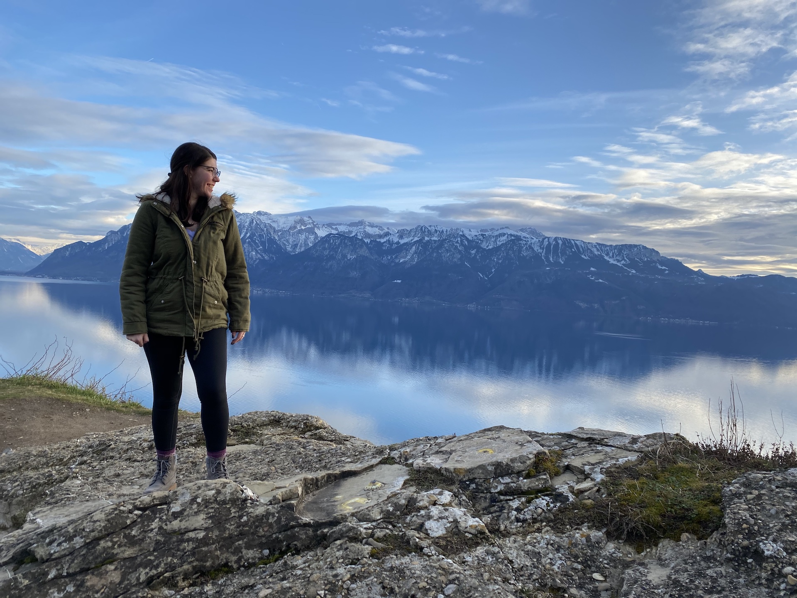

## *Hello!* 

My name is Savannah Hammerton, and I am a second year student in the M.S. in Epidemiology & Biostatistics program, with an emphasis in epidemiology. I'm also working towards the Graduate Certificate in Infectious Disease Epidemiology. I'm the GSEB Secretary, so come say hi during our events, or if you see me around Miller Hall (where I spend most of my time at this point)! 

### My Background and Interests 

I've taken an interesting route to get to where I am now. I switched my undergrad major a few times before becoming a Licensed Practical/Vocational Nurse (I trained in TN which uses the term "Practical" and worked in Texas which uses the term "Vocational"). I worked for a pediatric home health agency, and then for an acute psychiatric care facility on the adolescent unit. While I cared deeply for what I did, I wanted to finish my undergrad degree and went back to school. My plan was to attain a BSN, but I took Intro to Epidemiology and Microbiology for the Health Sciences in the same semester and was instantly hooked. I changed my major to Health Science with the goal to become an epidemiologist, focusing on infectious diseases. 

I have been working with Dr. Handel for the past few months on some norovirus research, working to build my data analysis and general coding skills at the same time. As I grow my skillset, I hope to expand my research into emerging, tropical, and zoonotic infectious diseases (basically everything that falls under the One Health umbrella - I think the interaction of humans, animals, and the environment as it relates to disease spread is fascinating). Overall, I'm happy studying anything infectious! 

### Fun Facts  
Outside of school and work, I try to keep up hobbies to take healthy breaks! I love crafting, and usually have some knitting, crocheting, or sewing project that I'm working on. I also try to spend as much time outside as I can, hiking, running, or walking (with my dog, Shadow!)

{width=75% height=75%}

### What I Hope to Learn in this Course 
I have a lot to learn in both working with R and GitHub as well as with data analysis in general. I hope to use this course to gain a better understanding of how to work with data in a efficient, accurate, reproducible way. While I've learned a fair amount about how things should work theoretically, I'm looking forward to getting a better understanding of practical applications! 

### Data Analysis Related Site 
[Here's a website](http://www.tylervigen.com/spurious-correlations) that I find funny/interesting called "Spurious Correlations." If I just look through the various charts, it's really entertaining, but I also think it's an important reminder that correlation does not equal causation!

