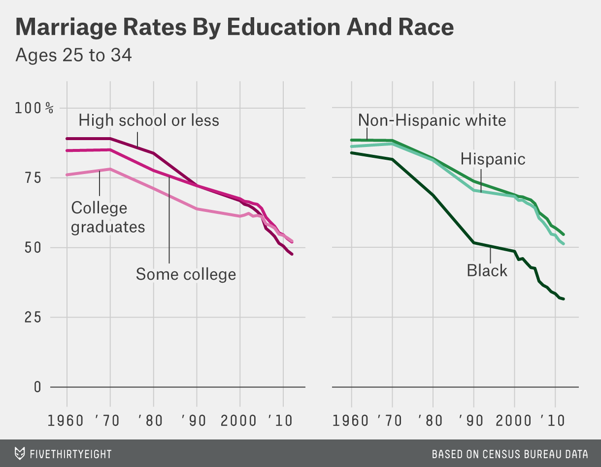

For this exercise, I will be [attempting to] recreate a figure I found at [fivethirtyeight.com](https://fivethirtyeight.com/features/marriage-isnt-dead-yet/). Here is the [link to the data](https://github.com/fivethirtyeight/data/tree/master/marriage) if you want to try recreating it as well! 

## Getting Started

Here is the figure I want to recreate.

{width=70%}

First, I need to load the packages I'll need to complete this exercise. 
```{r}
# package loading 
library(tidyverse) # for analysis and plotting
library(cowplot) # for combining plots into one figure 
```

Now I need to import the data set for the figure I want to recreate and set is as a new object.

```{r}
#import dataset and set to new object 
marriage <- read_csv('marriage/both_sexes.csv')
glimpse(marriage) # take a lot at the first bit of the dataset 
```

## Data Processing 

There is a lot of information in this dataset, much of which I won't need to create this figure, so I'm going to create another object only containing the data I need. 

```{r}
#create new object only containing the information needed to recreate figure 
# (year, education level, race information for 25-34 year olds)
mymarriage <- marriage %>% 
  select(year, all_2534, HS_2534, SC_2534, BAp_2534, BAo_2534, White_2534, Black_2534, Hisp_2534)
```

In the raw data, the values are the relevant proportion of the population that has never been married. However, the figure I'm recreating is the the proportion that _has_ been married, so I need to take the values, subtract them from one, and then for ease of plotting on a percent scale, I will multiply by 100. 

```{r}
#change marriage rates from never married proportion to have been married percentage
mymarriaget <- mymarriage %>% 
  mutate(HS_2534 = (1 - HS_2534) * 100) %>%
  mutate(SC_2534 = (1- SC_2534) * 100) %>%
  mutate(BAp_2534 = (1 - BAp_2534) * 100) %>%
  mutate(White_2534 = (1 - White_2534) * 100) %>% 
  mutate(Black_2534 = (1 - Black_2534) * 100) %>% 
  mutate(Hisp_2534 = (1 - Hisp_2534) * 100)
```


## Plot Creation

Now that I have my dataset set up the way I need it, I can go about creating my plots. The original figure is two plots in  one figure, so I will create each plot individually and then combine them.

```{r}
# create plot of marriage rate by education status 
educ <- ggplot(data = mymarriaget, aes(x = year)) +
  geom_line(aes(y = HS_2534, color = 'deeppink4')) + # high school or less
  geom_line(aes(y = SC_2534, color = 'deeppink3')) + # some college
  geom_line(aes(y = BAp_2534, color = 'deeppink2')) + # college graduates 
  scale_x_continuous(breaks = seq(from = 1960, to = 2012, by = 10), #imiating x scale on original
                     labels = c("1960", "'70", "'80", "'90", "2000", "'10")) +
  ylim(0,100) +
  theme(axis.title.x = element_blank(), axis.title.y = element_blank()) +
  scale_color_identity(guide = 'legend', name = 'Education Level', # creating legend 
                       breaks = c('deeppink2', 'deeppink3', 'deeppink4'),
                       labels = c('College Graduates', 'Some college', 'High school or less')) + 
  ggtitle('Marriage Rates by Education and Race','Ages 25-34') + # adding plot title 
  theme(legend.position = c(.75, .2)) + # positioning legend on bottom right of plot
  theme(legend.background = element_blank()) + # getting rid of legend box outline and fill 
  theme(legend.key = element_blank()) 
educ


# create plot of marriage rate by race - this will be done essentially the same way as the education graph, but I will not add a title to this one - having a title on the first graph in the combined figure will keep the title positioned in the top right as in the original figure 
race <- ggplot(data = mymarriaget, aes(x = year)) +
  geom_line(aes(y = White_2534, color = 'aquamarine3')) + #white
  geom_line(aes(y = Black_2534, color = 'aquamarine4')) + # black
  geom_line(aes(y = Hisp_2534, color = 'aquamarine2')) + #hispanic
  scale_x_continuous(breaks = seq(from = 1960, to = 2012, by = 10), #imitating x scale on original
                     labels = c("1960", "'70", "'80", "'90", "2000", "'10")) + 
  ylim(0,100) +
  theme(axis.title.x = element_blank(), axis.title.y = element_blank()) +
  scale_color_identity(guide = 'legend', name = 'Race',   # creating legend 
                       breaks = c('aquamarine3', 'aquamarine4', 'aquamarine2'),
                       labels = c('Non-Hispanic White', 'Black', 'Hispanic')) +
  theme(legend.position = c(.75, .2)) + # positioning legend on bottom right of plot
  theme(legend.background = element_blank()) +  # getting rid of legend box outline and fill 
  theme(legend.key = element_blank()) 

race
```

## Plot Combination and Figure Creation

Now that I have both of my plots created, I want to try and combine them into one figure, as that is how it was presented in the original figure. 

To do this, I will use the `cowplot` package's `plot_grid` function. 

```{r, fig.width=8, fig.asp=0.62}
# combining my education and race plots into one figure, and aligning them both vertically and horizontally 
finalvis <- plot_grid(educ, race, align = 'hv')
finalvis

# saving figure
figurefile = here::here('marriage', 'visualizationfigure.png')
ggsave(filename = figurefile, plot = finalvis)
```

{width=70%}


## Conclusions
The two figures are certainly not exactly the same, but I think I got decently close! I spent some time playing around with the `ggrepel` package, trying to use `geom_label_repel` to create the line labels like in the original graph, but the data was not in the quite the right format to use that without some serious manipulation, which seemed like it would maybe be a little overboard for this exercise, so I went with adding a legend. 

This was a great exercise in experimenting with visualization tools in R and all the associated packages. I'm looking forward to continuing to develop these skills! As we've seen and discussed this week, data visualization can be a powerful tool for presenting and communicating results. I hope to improve in this skill so that any analyses I perform can reach their full potential impact when presented to others. 

## Take two! 

After seeing some of the successful code used by my classmates, I decided to try and get this a little closer to the original! The simplest improvement will be the use of the `ggthemes` function `theme_fivethirtyeight()` to apply a similar theme to the plots as their source. I will also use `annotate()` and `geom_segment()` to add the labels as in the original figure rather than using a legend. 

Here we go with take two! 

```{r, fig.width=8, fig.asp=0.62}
# load additional library to apply a closer theme to the original 
library(ggthemes)

# create plot of marriage rate by education status using annotation 
educ2 <- ggplot(data = mymarriaget, aes(x = year)) +
  geom_line(aes(y = HS_2534), color = 'deeppink4') + # high school or less 
  annotate('text', x = 1975, y = 98, # add  high school label
           label = 'High school or less') +
  geom_segment(aes(x = 1975, xend = 1975, y = 86, yend = 95), # add high school label line
               color = 'black') +
  geom_line(aes(y = SC_2534), color = 'deeppink3') + # some college
  annotate('text', x = 1983, y = 45,
           label = 'Some college') + # add some college label
  geom_segment(aes(x = 1983, xend = 1983, y = 76, yend = 48),
               color = 'black') + # add some college label line
  geom_line(aes(y = BAp_2534), color = 'deeppink2') + # college graduates 
  annotate('text', x = 1967, y = 64,
           label = 'College graduates') + #add college grad label
  geom_segment(aes(x = 1967, xend = 1967, y = 67, yend = 76.8),
               color = 'black') + # add college grad label line
  scale_x_continuous(breaks = seq(from = 1960, to = 2012, by = 10), #imitating x scale on original
                     labels = c("1960", "'70", "'80", "'90", "2000", "'10")) +
  ylim(0,100) +
  ggtitle('Marriage Rates by Education and Race','Ages 25-34') + # adding plot title 
  theme(axis.title.x = element_blank(), 
        axis.title.y = element_blank()) +
  theme_fivethirtyeight()
educ2


# create plot of marriage rate by race using annotation 
race2 <- ggplot(data = mymarriaget, aes(x = year)) +
  geom_line(aes(y = White_2534), color = 'aquamarine3') + #white
  annotate('text', x = 1968, y = 98,
           label = 'Non-Hispanic White') + # add white label
  geom_segment(aes(x = 1964, xend = 1964, y = 88, yend = 95), # add white label line
               color = 'black') +
  geom_line(aes(y = Black_2534), color = 'aquamarine4') + # black
  annotate('text', x = 1994, y = 43, # add black label
           label = 'Black') +
  geom_segment(aes(x = 1994, xend = 1994, y = 50, yend = 45),
               color = 'black') + # add black label line
  geom_line(aes(y = Hisp_2534), color = 'aquamarine2') + #hispanic
  annotate('text', x = 1992, y = 83,
           label = 'Hispanic') + #add hispanic label
  geom_segment(aes(x = 1992, xend = 1992, y = 70, yend = 80),
               color = 'black') + # add hispanic label line 
  scale_x_continuous(breaks = seq(from = 1960, to = 2012, by = 10), #imitating x scale on original
                     labels = c("1960", "'70", "'80", "'90", "2000", "'10")) + 
  ylim(0,100) +
  theme(axis.text.y = element_blank(),
        axis.title.x = element_blank(), 
        axis.title.y = element_blank()) +
  theme_fivethirtyeight() 

race2


```

```{r, fig.width=11, fig.asp=0.80}

# combining my education and race plots into one figure, and aligning them both vertically and horizontally 
finalvis2 <- plot_grid(educ2, race2, align = 'hv') +
  theme_fivethirtyeight()
finalvis2

# saving new figure
figurefile2 = here::here('marriage', 'visualizationfigure2.png')
ggsave(filename = figurefile2, plot = finalvis2)

```

Here's the original one more time for reference! 
{width=70%}

I'm happier with this one! There are definitely still some differences, but I think the labeling vs. the legend and the addition of the theme helped a lot. I'm happy I was able to learn more to get this closer! 
